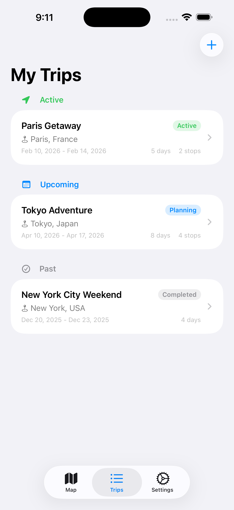

# TripWit

A privacy-first, AI-native iOS travel planner that spans the full trip lifecycle: **Plan > Experience > Remember**.

**No ads. No tracking. No accounts. No subscriptions.** Your travel data stays on your devices, synced privately through iCloud.

Plan dozens of future trips with detailed itineraries, use the app while traveling to track your journey, and automatically match photos from your camera roll to locations using GPS metadata.

<p align="center">
  
  &nbsp;&nbsp;
  
  &nbsp;&nbsp;
  
  &nbsp;&nbsp;
  
</p>

## Market Position

TripWit is the **Apple Notes of travel planning** -- private, fast, works offline, deeply integrated with the Apple ecosystem, and surprisingly powerful despite looking simple.

### What makes TripWit different

| | TripWit | Wanderlog | TripIt | Lambus |
|---|---|---|---|---|
| **AI engine** | On-device (Apple Intelligence) | Cloud-based (Pro) | Limited | Limited |
| **Privacy** | 100% on-device, zero cloud AI | Cloud processing | Cloud processing | Cloud processing |
| **Ads** | None, ever | Free tier has ads | Ads in free tier | None |
| **Subscription** | Free, no paywall | Freemium (~$50/yr) | Freemium ($49/yr) | Freemium (~$24/yr) |
| **Account required** | No | Yes | Yes | Yes |
| **Offline** | Full (local DB) | Basic free / Pro full | Full | Documents only |
| **iCloud Sync** | Yes (automatic) | Cross-device sync | Cross-device sync | Cross-device sync |

### Unique advantages

- **Zero data collection** -- no analytics, no telemetry, no ad SDKs, no third-party trackers
- **No account required** -- open the app and start planning immediately
- **On-device AI** via Apple Intelligence -- suggestions, vibe-based planning, itinerary parsing, nearby discovery, and place geocoding, all without sending data to the cloud
- **Photo matching** -- automatically matches camera roll photos to trip stops using GPS and timestamps
- **Weather forecasts** built into the day-by-day view
- **Paste any itinerary** -- convert ChatGPT outputs, blog posts, or emails into structured days and stops
- **Rich PDF export** with cover page, bookings, budget breakdown, and full itinerary
- **Calendar sync** -- export trip days to Apple Calendar with stop details
- **Checklist to stop** -- convert checklist items directly into day stops

### Security & Privacy

- **All data stored locally** in SwiftData with optional iCloud sync -- never touches third-party servers
- **No ad frameworks** -- zero AdMob, Meta SDK, or any advertising code in the binary
- **No analytics SDKs** -- no Firebase, Mixpanel, Amplitude, or telemetry of any kind
- **On-device AI only** -- Apple Intelligence runs locally, no prompts or data sent to cloud LLMs
- **No account or sign-in** -- the app works fully without creating any account
- **Minimal network calls** -- only Open-Meteo (weather) and Apple Maps (search) are contacted, both with no user-identifiable data

### Target audience

Solo travelers and couples who want powerful planning tools without subscriptions, accounts, or cloud dependency. Privacy-conscious users who prefer on-device intelligence over cloud AI.

## Features

### Trip Management
- Create and manage multiple trips with destinations, dates, and notes
- Trips organized by status: **Active**, **Upcoming**, and **Past**
- Auto-generated day-by-day itinerary based on trip dates
- Multi-city trip support with per-day locations
- Start and complete trips with one tap
- Budget tracking with currency support

### Itinerary Planning
- Add stops to each day with integrated Apple Maps place search
- Auto-fill address, phone, and website from search results
- Six stop categories: Accommodation, Restaurant, Attraction, Transport, Activity, Other
- Drag to reorder stops within a day
- Move stops between days via context menu
- Set arrival and departure times for each stop
- Editable day descriptions
- Paste itineraries from ChatGPT, blogs, or any text

### AI Features (iOS 26+, Apple Intelligence)
- **Daily suggestions** -- generate 5 stop ideas for any day
- **Vibe-based planning** -- describe a mood, get a full day itinerary
- **Nearby discovery** -- find places near any stop
- **Place geocoding** -- locate coordinates for any place name
- **Itinerary parsing** -- convert free-form text into structured stops

### Bookings
- Track flights, hotels, and car rentals with confirmation codes
- Import bookings from email confirmations
- All booking details in one place

### Expenses & Budget
- Set trip budget with multi-currency support
- Log categorized expenses (food, transport, activities, etc.)
- Visual progress bar with color-coded thresholds

### Lists & Checklists
- Multiple list types: Checklist, Packing, Shopping, To-Do, or custom
- Check/uncheck items with progress tracking
- Convert checklist items into day stops

### Map View
- Full-screen map showing all stops for any trip
- Auto-selects active or upcoming trip
- Color-coded pins by stop category

### Weather & Travel Times
- Weather forecasts for your destination via Open-Meteo
- Driving and walking time estimates between stops
- Daily distance summaries

### Photo Matching
- Automatically scan your camera roll
- Match photos to stops using GPS coordinates and timestamps
- Configurable search radius

### Wishlist
- Save places to visit later, organized by destination
- Convert wishlist items into trip stops

### Share & Export
- Export trip as a rich PDF itinerary (cover page, bookings, budget, days, checklists)
- Share trip as plain text via Messages, email, or any app
- Add trip days to Apple Calendar with stop details

### Sync
- iCloud sync across all your Apple devices

### Visited & Ratings
- Mark stops as visited with 1-5 star ratings
- Add comments to any stop

## Tech Stack

| Layer | Technology |
|-------|-----------|
| UI | SwiftUI |
| Data | SwiftData + CloudKit |
| Maps | MapKit |
| AI | Apple Intelligence (FoundationModels) |
| Weather | Open-Meteo API |
| Calendar | EventKit |
| Architecture | MVVM with @Observable |
| Min Target | iOS 17.0 |
| Swift | 6.2 (strict concurrency) |

## Project Structure

```
TripWit/
├── Packages/TripCore/          <- Pure Swift package (models, services, tests)
│   ├── Sources/TripCore/
│   │   ├── Models/             <- Trip, Day, Stop, MatchedPhoto, Coordinate
│   │   └── Services/           <- PhotoMatcher, GeoUtils, ItineraryEngine
│   └── Tests/TripCoreTests/    <- Unit tests
├── TripWit/                     <- SwiftUI app
│   ├── Data/                   <- SwiftData entities + DataManager
│   ├── Services/               <- CalendarService, WeatherService, TravelTime, PDF, TextExporter
│   ├── Views/                  <- All screens
│   └── Views/Components/       <- Reusable UI components
├── TripWitTests/                <- App-level tests
└── Scripts/                    <- CLI validation scripts
```

## Building

Requires Xcode 26+ and macOS 15+.

```bash
# Full validation (build + all tests)
./Scripts/validate.sh

# Fast logic tests only (no simulator needed)
./Scripts/test-logic.sh

# Build for simulator
xcodebuild build -scheme TripWit \
  -destination 'platform=iOS Simulator,name=iPhone 17 Pro' -quiet

# Regenerate Xcode project after changing project.yml
xcodegen generate
```

## License

Private -- All rights reserved.
